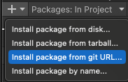

# UnityLocalMasterData

Unity クライアント内に同梱するローカルマスターデータ管理モジュールです。

Excel または Google SpreadSheet のシートをテーブルとして扱い、Editor 上で暗号化済み `.bin` に変換します。
ランタイムでは `StreamingAssets` から `.bin` を読み込み、型付きのテーブルクラスとして参照できます。

## Requirements

- Unity
- ExcelDataReader.DataSet v3.6.0 from NuGet
- Csv-CSharp v1.0.3 from NuGet

## 全体の流れ

1. マスターデータ用のテーブルクラスを実装する
2. Excel または SpreadSheet Writer アセットを作成する
3. Writer アセットに入出力先とセキュリティキーを設定する
4. Writer の `Build` を実行して `.bin` と鍵コードを生成する
5. ランタイムで `LocalMasterDataReader.Instance.BuildAsync(...)` を呼ぶ
6. 各テーブルの `Instance`、`Records`、`GetRecord(key)` からデータを読む

## テーブルクラスの実装

`LocalMasterDataTable<TKey, TRecord, TTable>` を継承したクラスを作成します。

```csharp
using LocalMasterData;

[LocalMasterData("Item")]
public sealed class ItemMasterTable :
    LocalMasterDataTable<int, ItemMasterTable.Record, ItemMasterTable>
{
    public sealed class Record
    {
        public int Id { get; set; }
        public string Name { get; set; }
        public string Description { get; set; }
        public ushort Rarity { get; set; }
    }

    public override int GetKey(Record record)
    {
        return record.Id;
    }
}
```

### 実装ルール

- `TRecord` は `class` かつ `new()` 可能な型にしてください。
- `Record` の列は public property として定義してください。field は読み書き対象になりません。
- シート 1 行目のヘッダー名と `Record` の property 名を完全一致させてください。
- `[LocalMasterData("Item")]` の名前は Excel のシート名、または SpreadSheet Writer の `Name` と一致させてください。
- `GetKey(record)` は `IdMap` に登録するキーを返してください。キー重複があると読み込み時に例外になります。
- Source Generator が属性付きテーブルをコンパイル時に登録します。実行時の型探索や `Activator.CreateInstance` は行いません。
- `ILocalMasterDataTable` は異なる型のテーブルを Reader が一括して読み込み、破棄するための共通契約として使用します。
- テーブルは非 abstract・非 generic で、引数なしコンストラクターから生成できる必要があります。シート名の重複などはコンパイルエラーになります。

### 対応する型

`Record` の property は以下の型をバイナリとして読み書きできます。

- `short`
- `int`
- `long`
- `ushort`
- `uint`
- `ulong`
- `float`
- `double`
- `bool`
- `DateTime`
- `string`

独自型を使用する場合は、以下の `LocalMasterDataResolver` に変換処理を登録してください。未登録の未対応型は Writer 側で文字列として書き出され、Reader 側で property 型へ代入できず失敗します。

数値は `InvariantCulture` で parse されます。小数は `1.5` のように `.` 区切りで入力してください。
`bool` は `true` / `false`、`DateTime` は `DateTime.Parse(..., InvariantCulture, DateTimeStyles.RoundtripKind)` で解釈できる文字列を入力してください。

### 独自型の登録（LocalMasterDataResolver）

アプリ側で `LocalMasterDataResolver.Register<T>(parse, write, read)` を呼び、型ごとの変換処理を登録できます。`LocalMasterData` 自体に独自型への依存を追加する必要はありません。

- `parse`：シートの文字列を `T` に変換します。空文字やヘッダーに存在しない列の既定値もここで処理します。
- `write`：変換済みの `T` を `BinaryWriter` へ書き込みます。
- `read`：`BinaryReader` から読み取り、property に代入する `T` を返します。`write` と同じ形式・バイト数で読み取ってください。

例えば、`GameDevelopmentKit.Fix` の固定小数点数を内部の `int Raw` として保存する場合は、アプリ側のランタイム用フォルダ（`Editor` フォルダの外）に次の登録クラスを置きます。

```csharp
using System.Globalization;
using GameDevelopmentKit;
using LocalMasterData;
using UnityEngine;

internal static class LocalMasterDataResolverRegistration
{
#if UNITY_EDITOR
    [UnityEditor.InitializeOnLoadMethod]
#endif
    [RuntimeInitializeOnLoadMethod(RuntimeInitializeLoadType.SubsystemRegistration)]
    private static void Register()
    {
        LocalMasterDataResolver.Register<Fix>(
            parse: value => string.IsNullOrEmpty(value)
                ? Fix.Zero
                : (Fix)double.Parse(value, CultureInfo.InvariantCulture),
            write: (writer, value) => writer.Write(value.Raw),
            read: reader => Fix.FromRaw(reader.ReadInt32()));
    }
}
```

この例ではシートに `1.25` のような実数値を入力します。`Fix.Scale` が `1000` なら、保存する整数値は `1250` です。読み取り時は `Fix.FromRaw` で復元します。

登録は Editor の Writer 実行前と、ランタイムの `BuildAsync` 実行前の両方で必要です。上記の属性で通常の初期化に対応できますが、他の初期化処理から早期にビルド・ロードする場合は、その処理より先に登録を完了してください。

組み込みの `TypeCode` 分岐が優先され、該当しない型だけ Resolver を参照します。`int` や `string` などの標準処理は登録で上書きできません。また、enum は基になる整数型の `TypeCode` に分類されるため、この登録方法によるカスタマイズの対象外です。

同じ型への再登録は以前の登録を置き換えます。登録・取得はロックで保護されていますが、読み書きの途中で登録を変更しないでください。変換関数は複数テーブルから並列に呼ばれるため、共有状態や Unity のメインスレッド専用 API に依存しない実装にしてください。

独自型の保存形式を変更した場合や、従来文字列で保存されていた型に Resolver を追加した場合は、対象の `.bin` を Writer で再生成してください。既存データの自動変換は行いません。

## マスターデータ表の形式

各シートが 1 テーブルになります。

| Id | Name | Description | Rarity |
| -- | -- | -- | -- |
| 1 | Potion | Recover HP | 1 |
| 2 | HiPotion | Recover more HP | 2 |

- 1 行目はヘッダー行です。
- 2 行目以降がレコードです。
- 空のヘッダー列は無視されます。
- ヘッダーに存在しない property は空文字として扱われます。組み込みの数値型は `0`、`bool` は `false`、`DateTime` は既定値になります。独自型の空文字は Resolver の `parse` で処理してください。
- property 定義を変更した場合は、必ず Writer で `.bin` を再生成してください。

## Writer アセットの作成

Unity Editor の Project ウィンドウで右クリックし、以下から Writer アセットを作成します。

- Excel: `Create > LocalMasterData > Excel Writer`
- SpreadSheet: `Create > LocalMasterData > SpreadSheet Writer`

Writer アセットでは以下を設定します。

- `OutputFolder`: `Assets/StreamingAssets` 配下の出力先フォルダ
- `OutputScriptFolder`: `Assets` 内の `Scripts` フォルダ配下
- `InputFolder`: Excel Writer のみ。`.xlsx` を置く `Editor` フォルダ配下

`OutputFolder`、`OutputScriptFolder`、`InputFolder` は、それぞれ上記の名前を含むフォルダ配下である必要があります。
条件を満たさない場合、Inspector にエラーが表示されて Build ボタンが使えません。

## Excel からビルドする

1. `.xlsx` ファイルを `InputFolder` 配下に置く
2. シート名を `[LocalMasterData]` の名前と一致させる
3. 1 行目に `Record` の property 名を入れる
4. Excel Writer アセットの `Build` を押す

ビルド時に、`InputFolder` 配下のすべての `.xlsx` が再帰的に読み込まれます。
各シートはシート名をキーにテーブルクラスへ対応付けられ、対応するクラスがないシートは warning のみ出して無視されます。

## SpreadSheet からビルドする

SpreadSheet Writer は Google Apps Script の Web App から CSV を取得して `.bin` を生成します。

### GAS の設定

`LocalMasterDataWriter/Editor/SpreadSheetGAS.js` の内容を Google Apps Script に貼り付け、Web App として Deploy してください。

Script Properties に以下を設定します。

- `API_TOKEN`: Writer からアクセスするための任意のトークン
- `SPREADSHEET_ID`: 対象 Google SpreadSheet の ID

Web App は `token` と `gid` を query parameter として受け取り、対象シートを CSV として返します。

### Writer の設定

SpreadSheet Writer アセットで以下を設定します。

- `m_ApiUrl`: Deploy した Web App の URL
- `m_ApiToken`: GAS の `API_TOKEN` と同じ値
- `m_Sheets[].Name`: テーブル名。`[LocalMasterData]` の名前と一致させる
- `m_Sheets[].Gid`: Google SpreadSheet のシート gid

Inspector では `Build All` で全シートをビルドできます。
各シート行の `Build` ボタンで 1 シートだけビルドすることもできます。

## 生成されるファイル

Writer の `Build` を実行すると以下が生成されます。

- `OutputFolder/<SheetName>.bin`
- `OutputScriptFolder/LocalMasterDataConst.cs`

対象テーブル一覧は Source Generator がコードとして生成するため、`lmd-enum.txt` は不要です。
`OutputFolder` が `Assets/StreamingAssets/Database` の場合、ランタイムでは以下のようなファイルを読みます。

```text
Application.streamingAssetsPath/Database/Item.bin
Application.streamingAssetsPath/Database/Quest.bin
Application.streamingAssetsPath/Database/Skill.bin
```

`LocalMasterDataConst.cs` には StreamingAssets の相対ディレクトリ、AES Key、HMAC Secret Key、RSA 公開鍵が出力されます。
RSA 秘密鍵は Writer アセットだけに保持され、ランタイムコードには出力されません。

## ランタイムで読み込む

起動時など、マスターデータ参照前に `BuildAsync` を呼びます。

```csharp
using LocalMasterData;
using UnityEngine;

public sealed class MasterDataBootstrap : MonoBehaviour
{
    private async void Start()
    {
        await LocalMasterDataReader.Instance.BuildAsync(
            LocalMasterDataConst.AesKey,
            LocalMasterDataConst.HmacSecretKey,
            LocalMasterDataConst.SigningPublicKeyModulus,
            LocalMasterDataConst.SigningPublicKeyExponent,
            LocalMasterDataConst.StreamingAssetsDirectory);

        var item = ItemMasterTable.Instance.GetRecord(1);
        Debug.Log(item?.Name);
    }
}
```

読み込み完了後は以下で参照できます。

```csharp
foreach (var record in ItemMasterTable.Instance.Records)
{
    Debug.Log($"{record.Id}: {record.Name}");
}

var item = ItemMasterTable.Instance.GetRecord(1);
```

### Reader の状態

- `LocalMasterDataReader.Instance.IsLoaded`: 読み込み完了済みか
- `LocalMasterDataReader.Instance.IsBuilding`: 読み込み中か
- `LocalMasterDataReader.Instance.Tables`: 読み込み済みテーブル一覧
- `LocalMasterDataReader.Exists`: Reader インスタンスが作成済みか

`LocalMasterDataTable<T>.Instance` は `BuildAsync` 完了前に参照すると例外になります。
また、同時に複数回 `BuildAsync` を呼ぶと `LocalMasterDataReader is already building.` で例外になります。

不要になった場合は `Dispose()` で読み込み済みテーブルと singleton を破棄できます。

```csharp
LocalMasterDataReader.Instance.Dispose();
```

## バイナリ仕様

Excel／SpreadSheet Writerの `Use Rsa Signature`（既定：有効）でRSA署名を切り替えられます。
無効でもAES暗号化とHMAC検証は行いますが、RSAによる署名者の検証は行いません。
Readerはヘッダーの署名長が0なら署名なしとして読み込みます。既存の署名ありファイルも読み込めます。
署名なし形式は旧Readerでは読み込めないため、Readerも更新してください。設定変更は再ビルドしたファイルに適用されます。

Writer は各テーブルを以下の順で処理します。

1. `Record` の public property 一覧を取得
2. 1 行目ヘッダーを property 名に対応付け
3. レコード数を書き込み
4. 各レコードの property 値を型ごとにバイナリ書き込み
5. Deflate 圧縮
6. ランダム IV で AES-256-CBC / PKCS7 暗号化
7. ヘッダー、IV、暗号文に HMAC-SHA256 を付与
8. ヘッダー、IV、暗号文、HMAC を RSA-SHA256 で署名

Reader は RSA 署名と HMAC を検証してから復号、展開し、`Records` と `IdMap` を構築します。
検証に失敗した場合は `CryptographicException` が発生します。

## 注意点

- `[LocalMasterData]` を付けたテーブルに対応する `.bin` が存在しない場合、ファイル読み込みで失敗します。
- シート名、Writer の Sheet Name、`[LocalMasterData]` の名前はすべて同じ名前にしてください。
- `Record` の property の追加、削除、型変更、順序変更後は `.bin` を再生成してください。
- 空文字を数値、bool、DateTime に変換することはできません。
- 暗号鍵または署名鍵を再生成した場合は、既存 `.bin` も再生成してください。
- 秘密鍵がクライアントビルドに含まれないよう、Writer アセットは `Editor` フォルダ内に置いてください。

## Installation with UPM

You can install this package from Unity Package Manager using the Git URL:

```text
https://github.com/yassy0413/UnityLocalMasterData.git
```




